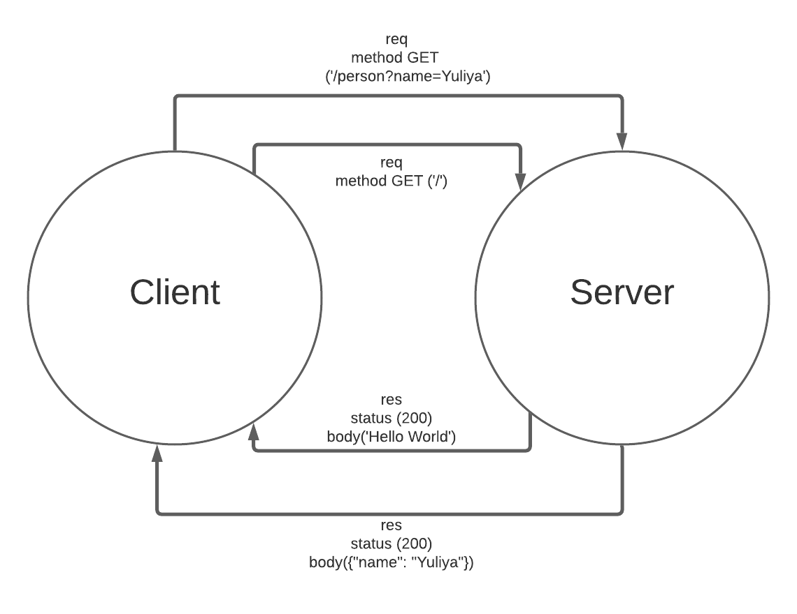

# LAB - Class 02  

## Project: Basic Express Server 

### Author: Yuliya Barysevich

### Links and Resources

1. Deployed with Heroku (2 routes)
    - [https://yuliya-basic-express-server.herokuapp.com/](https://yuliya-basic-express-server.herokuapp.com/)
    - [https://yuliya-basic-express-server.herokuapp.com/person?name=Yuliya](https://yuliya-basic-express-server.herokuapp.com/person?name=Yuliya)

2. Github URLs
    - [https://github.com/YuliyaBarysevich/basic-express-server/runs/2396631576](https://github.com/YuliyaBarysevich/basic-express-server/runs/2396631576)
    - [https://github.com/YuliyaBarysevich/basic-express-server/pull/1](https://github.com/YuliyaBarysevich/basic-express-server/pull/1)

### Setup

- **.env requirements** 
i.e.
  - PORT - Port Number

### How to initialize/run your application

- Download all dependencies `npm install`
- Create **.env** file and assign **PORT** variable to 3000
- Run command `nodemone` in terminal to start app on localhost:3333
- To run tests, run command `npm run test` in terminal

### Tests

- 404 on a bad route
- 404 on a bad method
- 500 if no name in the query string
- 200 if the name is in the query string
- given a name in the query string, the output object is correct

### WRRC

